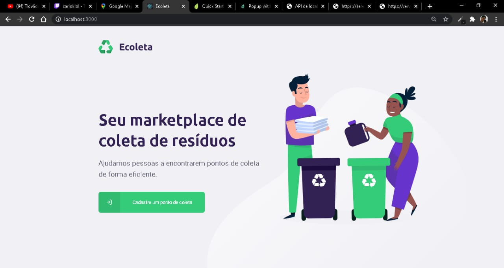
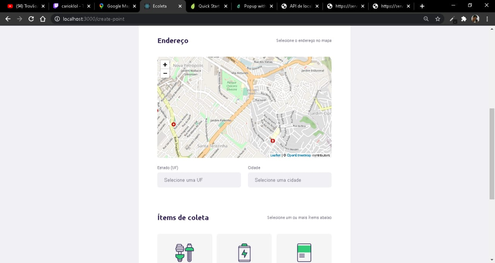
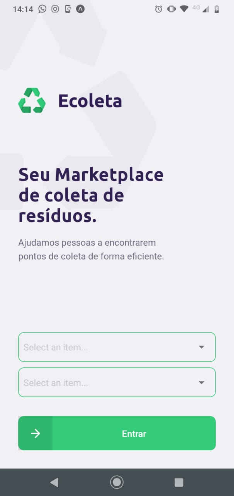
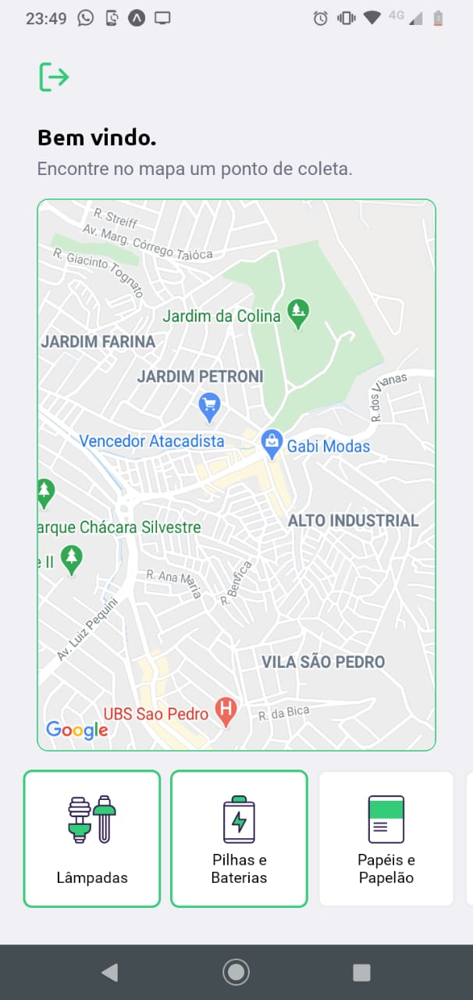

# Ecoleta-NLW01

 <h1 align="center">
    
</h1>

Projeto Desenvolvido durante a Next Level Week 01, ministrado pela Rockeseat

##WEB:
    
    
    
    
##Mobile:
    
    
    

##Tecnologias Utilizadas: 

- [Expo][expo]
- [Node.js][nodejs]
- [React][reactjs]
- [React Native][rn]
- [TypeScript][typescript]

Ferramentas usadas:

[nodejs]: https://nodejs.org/
[typescript]: https://www.typescriptlang.org/
[expo]: https://expo.io/
[reactjs]: https://reactjs.org
[rn]: https://facebook.github.io/react-native/
[yarn]: https://yarnpkg.com/
[vscode]: https://code.visualstudio.com/
[vceditconfig]: https://marketplace.visualstudio.com/items?itemName=EditorConfig.EditorConfig
[license]: https://opensource.org/licenses/MIT
[vceslint]: https://marketplace.visualstudio.com/items?itemName=dbaeumer.vscode-eslint
[prettier]: https://marketplace.visualstudio.com/items?itemName=esbenp.prettier-vscode
[rs]: https://rocketseat.com.br
