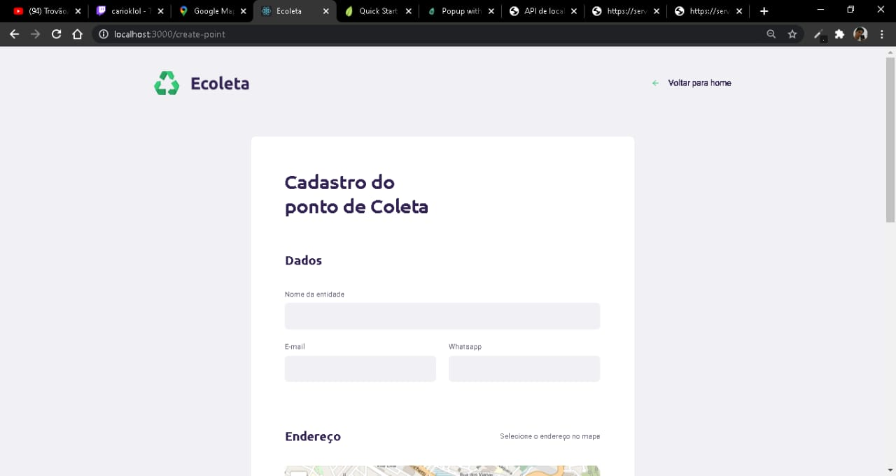

# Ecoleta-NLW01

 <h1 align="center">
    
</h1>

Projeto Desenvolvido durante a Next Level Week 01, ministrado pela Rockeseat

## WEB: 

 
    
## Mobile:
      

##Tecnologias Utilizadas: 

- [Expo][expo]
- [Node.js][nodejs]
- [React][reactjs]
- [React Native][rn]
- [TypeScript][typescript]

##Ferramentas usadas:

-[nodejs]: https://nodejs.org/ 
-[typescript]: https://www.typescriptlang.org/ 
-[expo]: https://expo.io/ 
-[reactjs]: https://reactjs.org 
-[rn]: https://facebook.github.io/react-native/ 
-[vscode]: https://code.visualstudio.com/g 
-[rs]: https://rocketseat.com.br 

Agradecimento especial a toda a Rocketseat pelo incrivel conteúdo ✌❤
